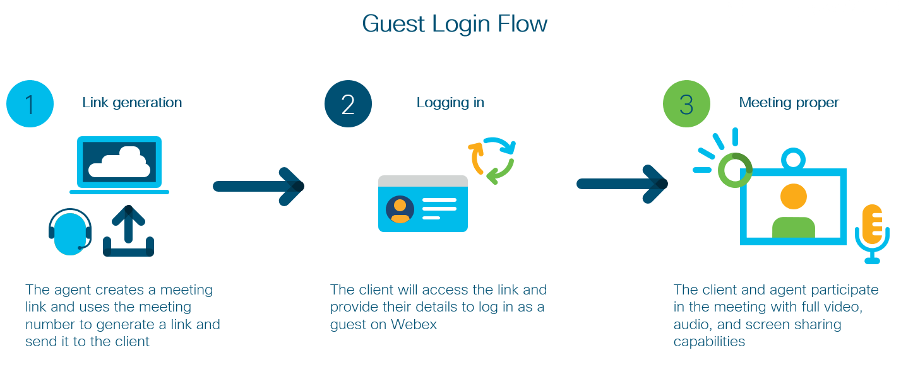

# Webex Web Browser
Providing a unified browser experience for Webex with meeting number connection.

| :exclamation:  External repository notice   |
|:---------------------------|
| This repository is now mirrored at "PLEASE UPDATE HERE - add External repo URL after code review is completed"  Please inform a https://github.com/gve-sw/ organization admin of any changes to mirror them to the external repo |

### High Level Design


## Contacts
* Josh Ingeniero (jingenie@cisco.com)

## Solution Components
* Webex Browser SDK
* Javascript
* Flask
* Python
* Docker

## Installation
### Python
#### Clone the repo
```console
git clone https://www.github.com/gve-sw/GVE_Devnet_Webex_Web_Browser
```

#### Set up a Python venv
First make sure that you have Python 3 installed on your machine. We will then be using venv to create
an isolated environment with only the necessary packages.

##### Install virtualenv via pip
```
$ pip install virtualenv
```

##### Create a new venv
```
Change to your project folder
$ cd GVE_Devnet_Webex_Web_Browser

Create the venv
$ virtualenv venv

Activate your venv
$ source venv/bin/activate
```

#### Install dependencies
```
$ pip install -r requirements.txt
```

### Docker
For Docker, you just need to have [Docker Desktop](https://www.docker.com/products/docker-desktop) installed


## Setup
You must configure [DETAILS.py](web-app/DETAILS.py) with the necessary configurations.
Please refer to [this](https://developer.webex.com/docs/guest-issuer) website for more information on 
generating a Guest Issuer for Webex.


```python
# Configure DETAILS.py with the necessary information
# Guest Issuer Details

ISSUER = 'GUEST ISSUER'
SECRET = 'GUEST SECRET'
VALIDITY = '24' # Token Validity in Hours

```


## Usage

### Python

Launch the Webex Web Browser app. Make sure that you have your venv activated.
```commandline
$ cd web-app
$ flask run
```
### Docker
Launch the Webex Web Browser app through the docker-compose file
```commandline
$ docker-compose up
```


### Running
Navigate to the corresponding localhost url:
```commandline
http://localhost:PORT/join/MEETINGNUMBER
```


# Screenshots

#### Login

#### Call Window


### LICENSE

Provided under Cisco Sample Code License, for details see [LICENSE](LICENSE.md)

### CODE OF CONDUCT

Our code of conduct is available [here](CODE_OF_CONDUCT.md)

### CONTRIBUTING

See our contributing guidelines [here](CONTRIBUTING.md)

#### DISCLAIMER:
<b>Please note:</b> This script is meant for demo purposes only. All tools/ scripts in this repo are released for use "AS IS" without any warranties of any kind, including, but not limited to their installation, use, or performance. Any use of these scripts and tools is at your own risk. There is no guarantee that they have been through thorough testing in a comparable environment and we are not responsible for any damage or data loss incurred with their use.
You are responsible for reviewing and testing any scripts you run thoroughly before use in any non-testing environment.